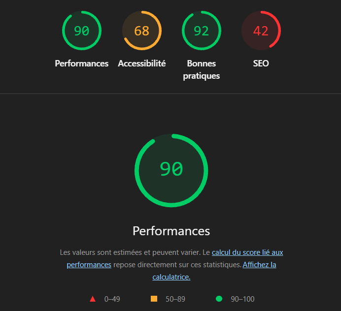
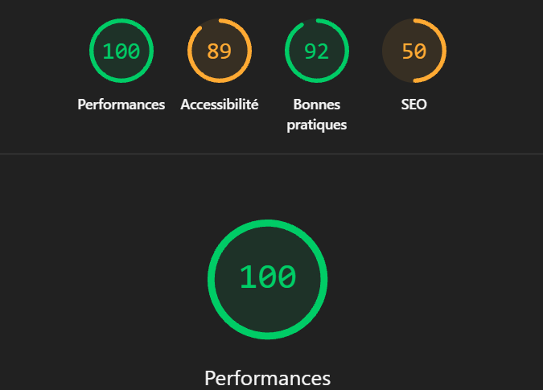
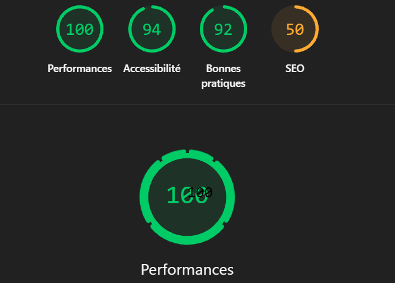
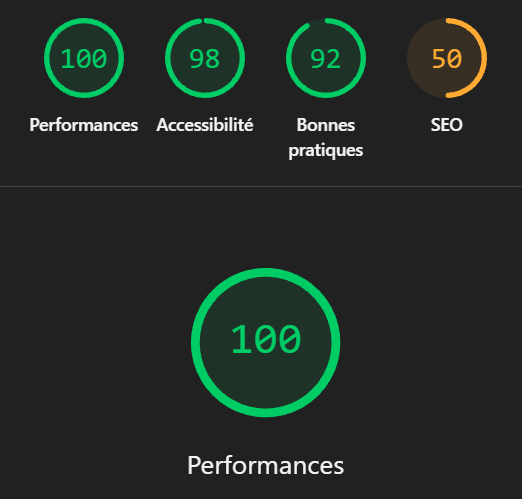

# Q1: Quels sont les arguments que vous pouvez utiliser pour convaincre votre Client de rendre son quizz accessible ? (Vous pouvez vous aider du cour)
Réponse: Augmente l’audience potentielle, améliore le référencement (SEO), renforce l’image de marque et permet de respecter les obligations légales.

# Q2: Ajouter le screen de votre score :
Screen: 

# Q3: Est-ce que l'analyse de Lighthouse est suffisante pour évaluer l'Accessibilité de votre Application ?
Réponse: Non il manque une vérification manuelle des bonnes pratiques et du visuel du site

# Q4: Combien de fois vous devez utiliser une touche du clavier pour passer le quizz ?
Réponse: Minimum 20 fois

# Q5: Donner 3 roles ARIA et 3 propriété ARIA
Réponse:

# Q6: Ajouter le screen de votre score Lighthouse
Screen: 

# Q7: L'une des best practice de l'ARIA est "ne pas utiliser l'ARIA" pouvez nous expliquer pourquoi d'après vous ?
Réponse: L'HTML Semantique est déjà accessible par défault. Utiliser l'aria augmente la declaration de données dans le code + ca peut détruire le site s'il est mal implémenté. 

# Q8: Ajouter le screen de votre score Lighthouse
Screen: 

# Q9: Pourquoi le score de lighthouse n'a pas augmenté d'après vous ?
Réponse: Il n'augmente pas ou peu car le code n'est pas "propre" + on a toujours des soucis SEO (j'ai un leger meilleur score car j'ai modifié et reorganisé du code)

# Q10: Quel est la valeur du rapport de contraste actuel :
Réponse: A

# Q11: Quel est la valeur du score AA :
Réponse: #949494 --> Debut pour être bien visible

# Q12: Quel est la valeur du score AAA :
Réponse: #b5b5b5 --> Clairement visible

# Q13: Comment pouvez vous changer la valeur du contraste de votre texte ?
Réponse: Automatiquement avec l'outil google ou avec le spectre de couleurs

# Q14: Ajouter le screen de votre score Lighthouse
Screen: 

# Q15: Êtes vous capable de déterminer visuellement ce qui est un lien ou pas en appliquant chaque altérations ?
Réponse: On s'y perd enormement suivant le type d'altération

# Q16: Ajouter le screen de votre score Lighthouse
Screen:

# Q17:  Proposition 1
Description:
Nb d'actions gagnée : 

# Q18:  Proposition 2
Description:
Nb d'actions gagnée : 

# Q19:  Proposition 3
Description:
Nb d'actions gagnée : 
